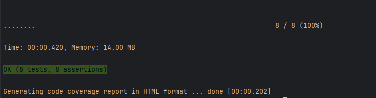
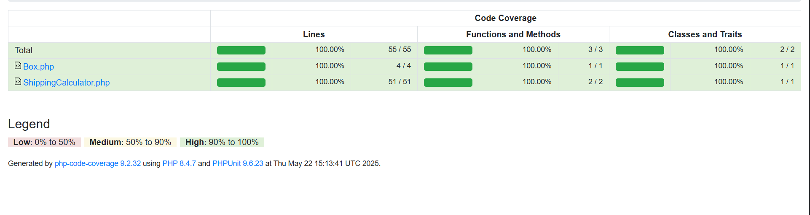
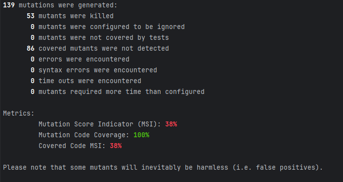

# Tema T5: Testare unitara in PHP - Mălușel Constantin-Bogdan

## Descriere :

Aplicatia consta in simularea unui locker specific firmelor de curierat, aplicatia contine 2 metode unde este calculat pretul in functie de dimensiune, masa, tipul coletului si o alta metoda in care se alege o cutie disponibila din locker. 

****

## Tehnologii folosite :

 - PHP 8.4.7
 - Phpunit
 - Infection

****

## Rulare teste:

 - Rulare teste cu acoperire `./vendor/bin/phpunit --coverage-html coverage --coverage-filter src`

 - Mutation Testing `./vendor/bin/infection --show-mutations`

****

## Teste implementate: 

  Au fost implementate teste functional cat si teste structurale, in tabelul de mai jos
exista o clasificare a lor:

| Denumire test                                       | Tip        |
|-----------------------------------------------------|------------|
| testItShouldThrowErrorWhenNegativeValuesAreInserted | Functional |
| testItShouldReturnMinimumCharge                     | Functional |
| testItShouldReturnCorrectPrice                      | Functional |
| testItShouldReturnCorrectIncreasedPriceBasedOnType  | Functional |
| testItShouldNotFindAnBox                            | Functional |
| testItShouldSelectAnEmptyBox                        | Structural |
| testItShouldCheckSurchargeMappingStructure          | Structural |
| testIsShouldMarkBoxAsOccupied                       | Structural |

****
## Exemplu rulare teste:

## Acoperire teste:

## Mutation testing:

